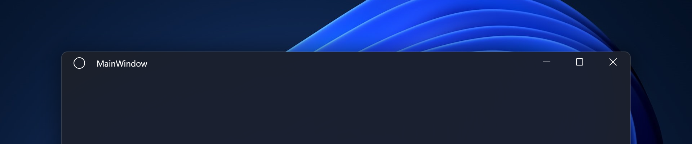
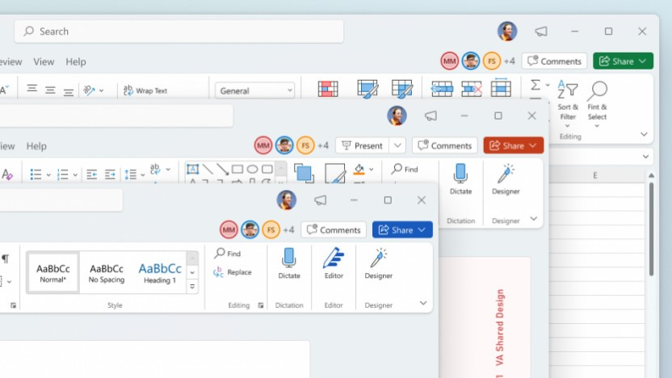
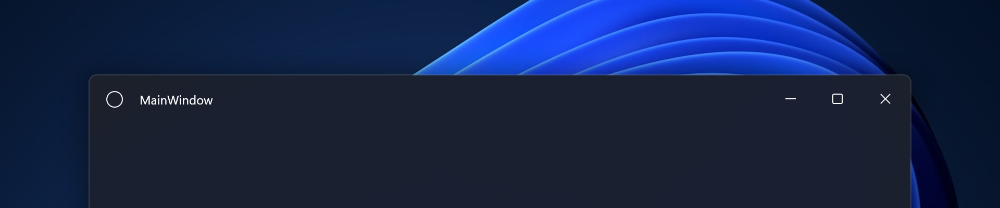

# FluentWindow
 A customizable WPF window that adheres to Fluent Design and Windows 11 Design Language. A simple way to apply the Mica material on your windows, fully customize the titlebar and more. Think of this as a modernized `<WindowChrome>`.

 This project was made in .NET 6.0 using C#.



## Setup

 In the repository, a `SampleApp` WPF project file is provided as a starting point. To integrate this with your project, do the following:-

 If you haven't already got a `Themes\Generic.xaml` ResourceDictionary file in your WPF project root directory, you can use the `Generic.xaml` in this repository.

 If you do, add the resource keys and styles from the file and add to your own.

 Add the `FluentWindow.cs` class file wherever best suits your WPF project folder structure.

 Create a new window or change one of your windows e.g. MainWindow.xaml to use `FluentWindow` like so:-

 ```csharp
<local:FluentWindow x:Class="SampleApp.MainWindow"
        xmlns="http://schemas.microsoft.com/winfx/2006/xaml/presentation"
        xmlns:x="http://schemas.microsoft.com/winfx/2006/xaml"
        xmlns:d="http://schemas.microsoft.com/expression/blend/2008"
        xmlns:mc="http://schemas.openxmlformats.org/markup-compatibility/2006"
        xmlns:local="clr-namespace:SampleApp"
        mc:Ignorable="d"
        Title="MainWindow" Height="450" Width="800">
    <Grid>

    </Grid>
</local:FluentWindow>
 ```

Don't forget to change in your `MainWindow.xaml.cs` to subclass from `FluentWindow` instead of `Window` like so:-

```csharp
public partial class MainWindow : FluentWindow
{
    public MainWindow()
    {
        InitializeComponent();
    }
}
```

And of course, change the namespaces appropriately to match your WPF project.

## User's Guide

By default, the Mica material is applied to the window (on Windows 11 systems) and provides a standard caption titlebar which is typical of a WPF window. The window uses Light/Dark mode defined by the Personalization settings and responds to changes. You can customise your window by adding/changing the properties provided below.

Here is a code snippet of `MainWindow.xaml` with all the options available set to default.

```xaml
<local:FluentWindow x:Class="SampleApp.MainWindow"
        xmlns="http://schemas.microsoft.com/winfx/2006/xaml/presentation"
        xmlns:x="http://schemas.microsoft.com/winfx/2006/xaml"
        xmlns:d="http://schemas.microsoft.com/expression/blend/2008"
        xmlns:mc="http://schemas.openxmlformats.org/markup-compatibility/2006"
        xmlns:local="clr-namespace:SampleApp"
        mc:Ignorable="d"
        EnableMica="True"
        CaptionHeight="28"
        ExtendViewIntoTitlebar="False"
        AppThemeColor="System"
        Title="MainWindow" Height="450" Width="800">
    <Grid>

    </Grid>
</local:FluentWindow>
```

### Mica material

 You can turn off Mica by adding the following property to the window's XAML:-

 ```xaml
 EnableMica="False"
 ```

### Titlebar options

 Also by default, a standard caption titlebar is provided. To fully customise the titlebar and remove the standard caption, add the following property:-

 ```xaml
 ExtendViewIntoTitlebar="True"
 ```

 In addition, you can customize the caption titlebar height by adding the following property:-

 ```xaml
 ExtendViewIntoTitlebar="True"
 CaptionHeight="48"
 ```

 Recommended: For full customisation, both `ExtendViewIntoTitlebar` and `CaptionHeight` need to be defined.

When the caption height is above 28 pixels (standard caption height), custom drawn caption buttons are drawn and utilize the customized caption height instead of using the native ones. This is so the caption button icons will align vertically centered which provides a cleaner look and lets you replicate the look in this mockup.



Actual implementation:-



Note: Icon and title will need to be custom drawn.

Since the caption height area is owned by the windowing system, to allow hit-testing on WPF controls in the caption area, simply add this to the appropriate controls much like you would if you were using the `<WindowChrome>` class:-

```xaml
<Button x:Name="CaptionButton" WindowChrome.IsHitTestVisibleInChrome="true"/>
```

###

You can force a Light or Dark theme on your window. This is useful if you want to design your app based on your brand e.g. Dark Mode for Spotify or Steam.

Options available are:-
`AppThemeColor="Light"` or `AppThemeColor="Dark"` or `AppThemeColor="System"`

You can also query if the app is running in Dark Mode by reading the `IsDarkMode` property to make appropriate `<Style>` changes.

`IsDarkMode` only returns true if `AppThemeColor` is set to `Dark` or if the system-defined setting is set to `Dark` in Windows Settings -> Personalization.

## Notes
This project was originally tested only for Windows 11 systems. In the future, I'll make some adjustments and modifications to the project when on Windows 10 to provide an satisfactory experience e.g. the custom caption button icons are based on Windows 11 and do not reflect Windows 10's look.

The project also doesn't support `WindowStyle="ToolWindow"` and impartial support for `WindowStyle="None"` currently but will add support later.

Despite my references and similarities to the `WindowChrome` class, I strongly advise from using the actual `WindowChrome` class in your `Window` (aside from attached properties like `IsHitTestVisibleInChrome`) to avoid conflicts with `FluentWindow`.

I also welcome any suggestions and feedback on how to improve `FluentWindow`.

## Acknowledgements
This project was made possible with the help of these references (and excessive use of P/Invoke):-

"Apply Mica to a WPF app on Windows 11 - Blogopolis, 2022"
https://tvc-16.science/mica-wpf.html 

"How to create a custom window in WPF | Magnus Montin"
https://blog.magnusmontin.net/2013/03/16/how-to-create-a-custom-window-in-wpf/

"WindowChromeWorker.cs"
https://referencesource.microsoft.com/#PresentationFramework/src/Framework/System/Windows/Shell/WindowChromeWorker.cs

I also recommend using "WPF UI" for controls and is available as a NuGet package:
https://github.com/lepoco/wpfui